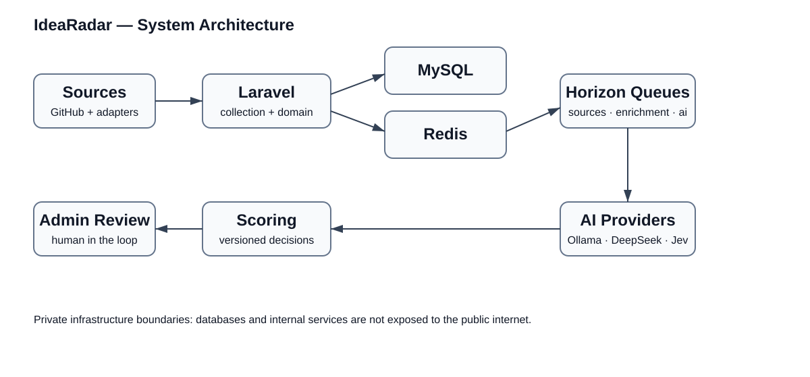
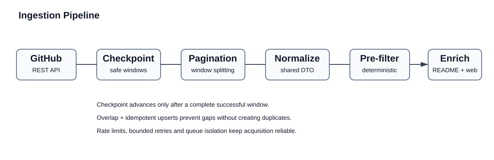

# IdeaRadar — Architecture & AI Pipeline Case Study

IdeaRadar is a production Laravel system that discovers newly created software projects, filters low-value repositories, enriches project data, and uses multiple AI stages to identify potentially interesting product opportunities.

This repository is a technical case study of the architecture behind the system. The production source code, infrastructure configuration, credentials, and data remain private. Published examples are sanitized and focus on architecture, reliability, security boundaries, and AI evaluation.

## What the system does

IdeaRadar processes discovered projects through independent stages:

1. Source collection
2. Deterministic pre-filtering
3. Metadata and README enrichment
4. Local LLM classification
5. External LLM analysis
6. Opportunity scoring
7. Growth signal tracking
8. Market validation
9. Human review

The system is designed around asynchronous processing, reproducibility, and controlled AI decisions rather than a single opaque LLM request.

## Core stack

- Laravel 13 / PHP 8.4
- MySQL 8.4 / Redis
- Laravel Horizon / Scheduler
- Docker / Linux
- GitHub REST API
- Ollama
- DeepSeek
- TypeSafe/Jev evaluation
- Provider-independent LLM layer

## Architecture



## Pipeline



```text
External Sources
      |
      v
Source Adapters
      |
      v
Collection Queue
      |
      v
Deterministic Pre-filter
      |
      +----> IGNORE
      |
      v
Metadata / README Enrichment
      |
      v
Local LLM Classification
      |
      +----> SKIP
      |
      v
External AI Analysis
      |
      v
Opportunity Scoring
      |
      +----> WATCH
      +----> INTERESTING
      +----> INVESTIGATE
                 |
                 v
          Market Validation
                 |
                 v
            Human Review
```

Each stage is independently observable and can be retried without repeating the entire pipeline.

## Source abstraction

Collection is not coupled to GitHub. Sources implement a common contract and return normalized project data. This allows additional sources to be introduced without coupling jobs, models, or scoring logic to a specific provider.

See [SourceInterface.php](examples/SourceInterface.php) and [SourceProjectData.php](examples/SourceProjectData.php).

## Reliability

The ingestion pipeline uses:

- checkpoint-based collection
- overlapping collection windows
- idempotent upserts
- pagination and automatic time-window splitting
- API rate-limit tracking
- bounded retries and backoff
- queue isolation
- controlled concurrency
- metric history only when values change

A failed collection window does not advance the checkpoint, preventing temporary API failures from silently creating gaps.

## Queue architecture

Workloads are separated by responsibility:

```text
sources
enrichment
metrics
ai
```

Collection has priority over optional enrichment and AI processing, so expensive downstream work cannot block acquisition of new source data.

## AI pipeline


AI is treated as a versioned processing stage rather than an opaque API call. Relevant analyses can retain provider, model, prompt version, input hash, structured output, token usage, latency, processing status, error information, and score version.

This makes model and prompt changes measurable and decisions reproducible.

See [AiProviderInterface.php](examples/AiProviderInterface.php) and [AI pipeline notes](docs/ai-pipeline.md).

## Local-first filtering

```text
Raw projects
    |
    v
PHP deterministic filters
    |
    v
Local model
    |
    v
External model
    |
    v
Market validation
```

Expensive external analysis is deliberately not the first filtering stage.

## TypeSafe/Jev evaluation

A separate experiment introduced TypeSafe/Jev into the existing pipeline without immediately replacing the production classifier.

The benchmark processed 4,344 real GitHub projects, approximately 4.76M input tokens, in about 47 minutes, with 611 ms median API latency and zero processing errors.

More importantly, the comparison exposed classification disagreements, uncertainty-handling differences, and a dataset-selection issue affecting the initial benchmark.

See [TypeSafe/Jev benchmark](docs/benchmarks/typesafe-jev.md).

## Security boundaries

Production safeguards include private database/cache networking, protected administrative interfaces, disabled production debug mode, secret exclusion from source control, SSRF-aware external URL validation, redirect revalidation, bounded response sizes/timeouts, and log redaction for credentials.

See [Security](docs/security.md).

## Why this repository exists

The difficult engineering work in AI products is rarely the LLM request itself. It is deciding what reaches the model, controlling cost, handling failures, preserving evidence, making decisions reproducible, comparing models, changing providers safely, and keeping asynchronous pipelines observable.

This repository documents those decisions without publishing the production application, credentials, or private data.
